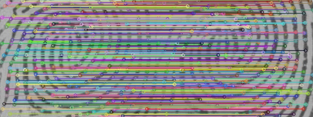

# 👋 Hi, I'm Dayne Guy

🎓 **M.S. in Computer Engineering @ University of South Florida**  
💡 AI Engineer | Computer Vision| FPGA/ASIC Enthusiast  
📍 Tampa, FL | 🌐 [dayngerous.me](https://dayngerous.me)

---

## 🧠 Research & Technical Interests
- **Graph Neural Networks (GNNs)** and **Differentiable Graph Matching**
- **Natural Language Processing:** Integrating LLM bias into constituency parsing, multi-token generation
- **Computer Vision:** Fingerprint Recognition, Object Detection, Scene Understanding  
- **Hardware Acceleration:** FPGA/ASIC Design, HLS C/C++, CUDA, and ONNX Deployment  
- **Model Optimization:** Quantization, Multi-stage Learning, Energy-Efficient AI  

---

## 🚀 Featured Projects

### 🔹 [Test Generator for VLSI Circuits](https://github.com/dayne-2stacks/test_gen)
Automatic Test Generator (ATG) for single stuck-at faults — built with Lazar Lazarevic.  
Generates test vectors using **D-Algorithm, PODEM, and Boolean Satisfiability**, with support for fault collapsing and simulation.

📺 **Demo:**  

**Key features:**
- Interactive CLI menu
- Parses gate-level netlists  
- Fault collapsing & equivalence detection  
- Detectable/undetectable fault reporting  
- Multiple ATG strategies (D-Algo / PODEM / SAT)

### 🔹 [Fingerprint-Matching-Code](https://github.com/dayne-2stacks/Fingerprint-Matching-Code)
Deep Level-3 fingerprint matching pipeline integrating graph matching and differentiable Sinkhorn algorithms.  

**What this pipeline does:**
- Builds a graph representation from fingerprint pore features
- Learns structural correspondences using attention-based graph matching model
- Uses the Sinkhorn algorithm to compute soft matches
- Uses attention to differentiably select top K correspondences

**Tech:** PyTorch, Top-K Matching, CUDA, Optimal Transport

### 🔹 [Hybrid-Constituency-Parser](https://github.com/dayne-2stacks/parser)
Bridges grammar-based parsing with LLM priors to improve low-data syntactic learning.  
**Tech:** Transformers, PCFGs, PyTorch, Span Interpolation

### 🔹 [portfolio-1](https://github.com/dayneguy/portfolio-1)
Next.js-based portfolio showcasing AI and hardware projects with interactive components.  
**Tech:** Next.js, TailwindCSS, React Hooks, SEO Optimization

---

## 🛠️ Tech Stack
**Languages:** Python, C/C++, Verilog, CUDA  
**Frameworks:** PyTorch, TensorFlow, LangChain, OpenAI API  
**Hardware Tools:** Vivado, Vitis IDE, HSPICE, Cadence Virtuoso  
**Other:** Docker, Git, Next.js, Azure, AWS  

---

## 🌱 Currently Exploring
- Multi-stage optimization for graph matching models  
- Hardware-accelerated AI inference  
- Sustainable AI & resource-efficient deep learning  

---

## 📊 GitHub Analytics

---

## 🧩 Connect With Me
[💼 LinkedIn](https://linkedin.com/in/dayneguy)  
[🌐 Portfolio](https://daynegerous.me)  
[📧 Email](mailto:dayneguy@usf.edu)

---

> _“Bridging symbolic reasoning, neural computation, and hardware acceleration — one model at a time.”_

